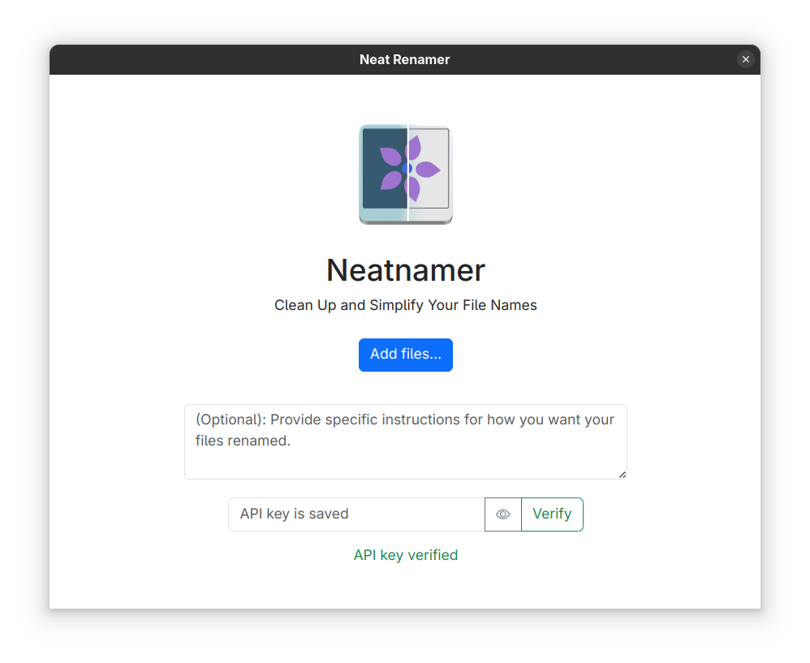

# Neatnamer

A smart file renaming tool that uses AI to transform messy and inconsistent filenames into clean, organized, and meaningful names. Neat-Namer helps you maintain a tidy file system with minimal effort.



## Features

- **AI-Powered Renaming**: Uses Google's Gemini AI to intelligently rename files
- **Dual Mode Processing**:
  - **Text Mode**: Clean up text-based filenames by removing special characters, normalizing case, and improving readability
  - **Image Mode**: Generate descriptive names for images by analyzing their content
- **Batch Processing**: Rename multiple files simultaneously  
- **Custom Instructions**: Provide specific guidelines for how you want your files renamed
- **Preview Before Saving**: Review the proposed names before finalizing changes
- **Export Options**: Save renamed files as a convenient zip package

## Preinstalled Binaries

For quick and easy setup, download the preinstalled binaries directly from the GitHub repository:

1. Visit the [Releases](https://github.com/codebyahmed/Neat-Namer/releases) page
2. Download the appropriate version for your operating system:
   - Windows: `neatnamer-windows.exe`
   - Linux: `neatnamer-linux`
3. Run the application directly - no installation required

## Installation from Source

### Prerequisites

- Python 3.8 or higher
- Google Gemini API key ([Get it here](https://makersuite.google.com/app/apikey))

### Setup

1. Clone the repository:
   ```bash
   git clone https://github.com/yourusername/Neat-Namer.git
   cd Neat-Namer
   ```

2. Install dependencies:
   ```bash
   pip install -r requirements.txt
   ```

3. Run the application:
   ```bash
   python app.py
   ```

## Custom Instructions

You can provide custom instructions to guide the renaming process. Examples:

- "Remove product codes but keep dates"
- "Format all names in Title Case"
- "Include the primary color of each image in the filename"
- "Use technical terminology for scientific documents"

---

**Note:** This tool requires internet access to connect with the Gemini API for intelligent renaming capabilities.
